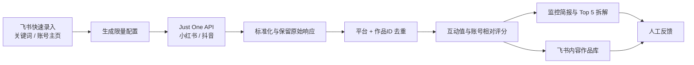

# Content Boom Monitor

一个用于监控 **小红书 / 抖音关键词**与**对标账号**的 Codex Skill。

它通过 [Just One API](https://docs.justoneapi.com/zh/) 采集公开内容数据，完成标准化、去重、账号相对表现评分和重点内容筛选，并把结果沉淀到飞书多维表格。

> 目标不是“预测爆款”，而是用稳定的数据流程发现异常内容、增长信号和可复用选题，让人只处理值得关注的少量结果。

## 能做什么

- 同时监控小红书、抖音关键词；
- 监控指定对标账号的近期作品；
- 统一不同平台的作品、作者和互动字段；
- 按 `平台 + 作品ID` 跨来源去重；
- 计算平台差异化互动值；
- 用账号历史中位数计算相对表现 `R`；
- 标记 `T1 潜力 / T2 爆款 / T3 现象级` 等审阅等级；
- 生成包含关键词表现、账号异常、Top 10 和数据限制的监控简报；
- 让 Codex 对 Top 5 做证据有边界的 AI 辅助拆解；
- 预览并发布到飞书内容作品库；
- 读取飞书中的关键词和账号主页，把人的输入压缩到最少。

## 两套监控引擎

| 引擎 | 回答的问题 | 主要用途 |
|---|---|---|
| 关键词监控 | 这个赛道最近出现了什么？ | 发现新话题、新表达和跨账号信号 |
| 对标账号监控 | 这个账号哪条作品明显高于自己的常态？ | 发现小账号异常内容，避免只看绝对大流量 |

关键词结果默认标记为“新发现”；只有同一账号在本轮拥有足够可用作品样本时才计算相对表现，避免把搜索结果的绝对互动量误判成爆款概率。

## 工作流程



稳定、可复现的环节由程序完成；需要语义理解的内容拆解交给 AI；内容是否符合业务最终由人判断。

## 对标账号监控是怎么工作的

每次运行都会执行下面这条确定性链路：

1. 从飞书「对标账号」表读取未停用、未暂停的账号；
2. 从主页链接识别小红书或抖音，并解析平台账号 ID；
3. 调用账号作品接口，试跑模式最多保留最近 8 条；
4. 把两个平台的作品转换成统一字段；
5. 用 `平台 + 作品ID` 去重：新作品准备新增，已有作品准备更新；
6. 计算每条作品的互动值；
7. 用这条作品与同账号本轮其他可用作品的互动值中位数比较，得到 `R`；
8. 按 T1/T2/T3 等级排序，生成报告并写入飞书。

例如某账号本轮其他作品互动值中位数为 100，一条新作品互动值为 850，则 `R = 8.5`。当它同时达到绝对互动证据门槛时，会标记为 `T3 现象级`，优先交给人复盘。

### 如何变成每天自动运行

当前仓库提供的是可重复执行的监控流程，不绑定某一种调度器。可以用 Codex Automation、cron、CI 或服务器定时任务依次运行：

```bash
python3 scripts/build_config_from_feishu.py \
  --direction "你的内容方向" \
  --output pilot-config.json

python3 scripts/pilot_monitor.py \
  --config pilot-config.json \
  --output-dir pilot-output

python3 scripts/publish_feishu.py \
  --input pilot-output/feishu_rows.json \
  --write
```

将 `--write` 放入无人值守任务前，应先完成一次人工试跑，并明确授权这个定时流程可以写入指定 Base。

如果要识别“这条作品今天正在快速起量”，还需要在下一阶段保存上轮点赞、收藏、评论和分享快照，再计算跨轮增量和单位时间增长速度。当前版本识别的是**同账号作品之间的相对异常**，不是跨天增长速度。

## 安装

### 1. 克隆到 Codex Skills 目录

```bash
git clone https://github.com/xintu1314/content-boom-monitor.git \
  ~/.codex/skills/content-boom-monitor
```

也可以克隆到其他目录，再按你的 Codex 环境配置 Skill 搜索路径。

### 2. 准备依赖

- Python 3；
- 可正常使用的 Codex；
- [Just One API](https://docs.justoneapi.com/zh/) Token；
- 已完成用户授权的 `lark-cli`；
- 一个包含关键词表、账号表和内容作品表的飞书多维表格。

## 配置

### Just One API

```bash
export JUSTONE_API_TOKEN="<your-token>"
```

不要把真实 Token 写进 Skill、配置文件、报告、日志或飞书。

### 飞书 Base

```bash
export CBM_FEISHU_BASE_TOKEN="<base-token>"
export CBM_FEISHU_KEYWORD_TABLE_ID="<keyword-table-id>"
export CBM_FEISHU_ACCOUNT_TABLE_ID="<account-table-id>"
export CBM_FEISHU_CONTENT_TABLE_ID="<content-table-id>"
```

也可以在运行脚本时传入对应参数。具体表结构见 [`references/feishu-schema.md`](references/feishu-schema.md)。

### 推荐的日常输入

飞书只需要向人展示：

- `监控关键词 / 快速录入`：关键词、可选监控平台；
- `对标账号 / 快速录入`：可选账号名称、可选平台、主页链接；
- `内容作品库 / 重点内容`：重点指标、AI 洞察、作品链接和处理状态。

关键词平台留空表示同时监控小红书与抖音；账号平台可以从主页链接自动识别。

## 第一次试跑

先进入 Skill 目录：

```bash
cd ~/.codex/skills/content-boom-monitor
```

### 1. 从飞书生成限量配置

```bash
python3 scripts/build_config_from_feishu.py \
  --direction "你的内容方向" \
  --output pilot-config.json
```

默认上限：

- 3 个关键词；
- 每个平台 2 个对标账号；
- 每个任务 1 页；
- 每个关键词最多保留 5 条；
- 每个账号最多保留 8 条。

### 2. 执行采集和评分

```bash
python3 scripts/pilot_monitor.py \
  --config pilot-config.json \
  --output-dir pilot-output
```

### 3. 检查输出

```text
pilot-output/
├── raw/               # 脱敏后的原始 API 响应
├── normalized.json    # 标准化、去重后的作品
├── scored.json        # 互动值和账号相对评分
├── feishu_rows.json   # 飞书字段映射结果
└── report.md          # 监控简报
```

在发布前，重点抽查：

- 作品 ID、作者和链接是否正确；
- 缺失指标是否保持为空；
- API 是否出现无法识别的作品列表；
- 账号评分是否至少有 5 条可用历史作品；
- `report.md` 中的事实和 AI 推断是否清楚分开。

### 4. 预览飞书写入

```bash
python3 scripts/publish_feishu.py \
  --input pilot-output/feishu_rows.json
```

### 5. 获得授权后正式写入

```bash
python3 scripts/publish_feishu.py \
  --input pilot-output/feishu_rows.json \
  --write
```

发布器使用 `平台 + 作品ID` 去重：已有作品更新，新作品批量创建。

## 评分方式

### 互动值

小红书：

```text
点赞 + 2 × 收藏 + 2 × 评论
```

抖音：

```text
点赞 + 2 × 收藏 + 3 × 评论 + 4 × 分享
```

只使用接口实际提供的指标，不把缺失指标描述成真实的 0。

### 账号相对表现

```text
R = 当前作品互动值 ÷ 同账号本轮其他可用作品互动值中位数
```

至少需要 5 条对比作品。

| 等级 | 条件 |
|---|---|
| T3 现象级 | `R >= 8` 且达到互动证据门槛 |
| T2 爆款 | `R >= 4` 且达到互动证据门槛 |
| T1 潜力 | `R >= 2` 且达到互动证据门槛 |
| 虚高 | `R >= 2`，但绝对互动证据不足 |
| 普通 | 有可用基线且 `R < 2` |
| 新发现 | 关键词结果或历史样本不足 |

等级用于安排审阅优先级，不是流量预测或成功保证。完整规则见 [`references/scoring.md`](references/scoring.md)。

## 人需要做什么

日常只需要：

1. 添加关键词；
2. 粘贴对标账号主页；
3. 对重点作品标记 `值得跟进 / 继续观察 / 不相关 / 已采用`。

作品 ID、作者 ID、互动指标、评分、采集时间和运行状态都应由自动化处理。

## 项目结构

```text
content-boom-monitor/
├── SKILL.md
├── agents/
│   └── openai.yaml
├── references/
│   ├── feishu-schema.md
│   ├── justoneapi.md
│   ├── pilot-config.md
│   └── scoring.md
└── scripts/
    ├── build_config_from_feishu.py
    ├── pilot_monitor.py
    └── publish_feishu.py
```

## 当前边界

当前版本已经覆盖：关键词/账号采集、字段标准化、去重、相对评分、监控简报和飞书入库。

尚未内置：

- 定时调度；
- 多轮指标快照与增量速度；
- 视频下载、封面转存和 ASR；
- 评论区分析；
- 飞书群日报与异常告警；
- 自动创建单条爆款拆解文档。

建议先用小样本验证字段、成本和相关性，再逐步扩大关键词、账号、页数和详情接口调用。

## 安全与使用说明

- 仅处理你有权使用的公开数据；
- 遵守平台规则、API 服务条款和适用法律；
- 不要提交 `.env`、真实 Token、飞书 Base 标识或原始采集数据；
- 正式写飞书前先预览，并获得明确授权；
- 本项目提供的是监控和审阅辅助，不保证内容表现。

## 参考资料

- [Just One API 中文文档](https://docs.justoneapi.com/zh/)
- [飞书：如何用 Coze 和飞书搭建爆款监控系统](https://www.feishu.cn/content/article/7647059037481094382)

## License

当前仓库尚未指定开源许可证。未经许可，不代表自动获得复制、修改或分发权。
